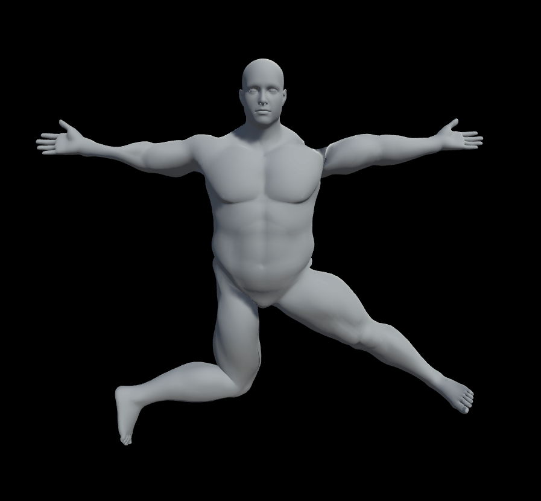
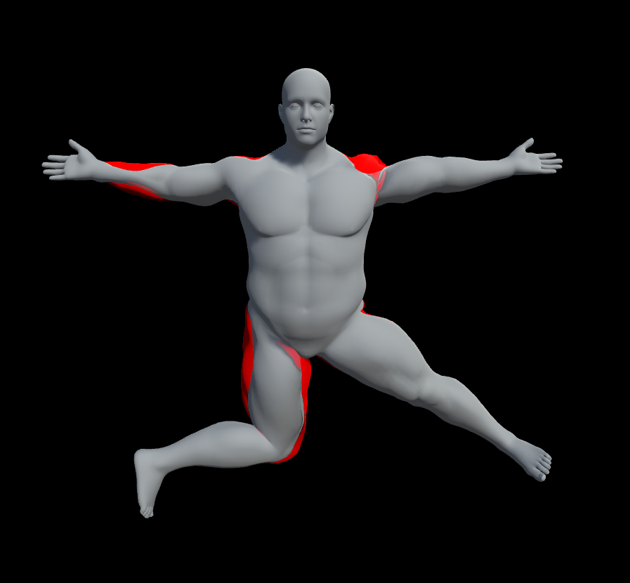

# Dual quaternion skinning for Unity3D

### Features:
* GPU skinning with compute shaders (only)
* blend shape support (calculations performed in compute shader)
* works with any platform that supports compute shaders
* preserves volume with deformation (look comparison)
* zero GC allocations per frame

 

### Comparison:

|Gif|Difference|
|----|----|
|||

 

### Warning:
You will not see any effect in edit mode. 
The scipt only works in play mode. 
If you see no effect in play mode verify that you are using the right shader.

   

### Performance:

During my testing the amount of time spent on actual skinning was negligible compared to the amount of time extracting `transform.position` and `transform.rotation` from every bone in the hierarchy.

As long as you are not creating hundreds of characters with complex rigs (no matter the polycount) there should be no significant performance hit.

If anyone knows how to optimize extracting position and rotation of the bones please create an [issue](https://github.com/ConstantineRudenko/DQ-skinning-for-Unity/issues) or message me on the [unity forum](https://forum.unity.com/threads/dual-quaternion-skinning-for-unity.501245/).

   

### How to set up

* Create a normal skinned character with `SkinnedMeshRenderer` component
* Add `DualQuaternionSkinner.cs` component (it will require a `MeshFilter` component)
* All materials of the mesh should use special shader to apply vertex positions

The shader is `MadCake/Material/Standard hacked for DQ skinning`

   

### Why do i need SkinnedMeshRenderer?

My scripts uses `SkinnedMeshRenderer` to extract an array of bones from it. Yep, that's it. 
The order of bones is unpredictable and does not depent on their hierarchy. 
Only SkinnedMeshRenderer knows it &nbsp;&nbsp; ¯\\\_(ツ)\_/¯

After extracting the bone array in `Start()` my script removes `SkinnedMeshRenderer` component as it is no longer needed. 
All the animations are made by the script. 
You can verify it in the editor after hitting play button.

   

### How do i use custom shaders?

Alas it's complicated. 
I added comments to "Standard hacked for DQ skinning" marking the alterations i made to the Standard shader. 
You can try to do the same with your own shader to make it work with the script.

Feel free to contact me in [this thread](https://forum.unity.com/threads/dual-quaternion-skinning-for-unity.501245/) at unity forum if you need help.

I would also like to hear about your projects that use my script and your experience with it.

 

----

### API

`class DualQuaternionSkinner : MonoBehaviour`

  

**public fields:**

<table>
<tr>
  <th>type</th>
  <th>Name</th>
  <th>Description</th>
</tr>
<tr>
  <td>ComputeShader</td>
  <td><b>shaderComputeBoneDQ</b></td>
  <td rowspan="3">These fields hold references to compute shaders used by the script. They are assigned automatically.  Do not change them unless you know what you're doing.</td>
</tr>
<tr>
  <td>ComputeShader</td>
  <td><b>shaderDQBlend</b></td>
</tr>
<tr>
  <td>ComputeShader</td>
  <td><b>shaderApplyMorph</b></td>
</tr>
<tr>
  <td>bool</td>
  <td><b>started</b></td>
  <td>Indicates whether <b>Start()</b> method of the script has already been called.   Useful to know whether the <b>SkinnedMeshRenderer</b> component was already destroyed.</td>
</tr>
</table>

   
**public methods:**

<table>
<tr>
  <th width="80">return type</th>
  <th width="360">Name</th>
  <th>Description</th>
</tr>
<tr>
  <td>float[ ]</td>
  <td><b>GetBlendShapeWeights</b>( )</td>
  <td>Returns an array of currently applied blend shape weights sorted by blend shape index.</td>
</tr>
<tr>
  <td>void</td>
  <td><b>SetBlendShapeWeights</b>(float[ ] <b>weights</b>)</td>
  <td>Applies blend shape weights from given array.  The length of provided array must match the number of blend shapes that currently rendered mesh has.</td>
</tr>
<tr>
  <td>float</td>
  <td><b>GetBlendShapeWeight</b>(int <b>index</b>)</td>
  <td>Returns the currently applied weight for the blend shape with given index.</td>
</tr>
<tr>
  <td>void</td>
  <td><b>SetBlendShapeWeight</b>(int <b>index</b>, float <b>weight</b>)</td>
  <td>Applies the weight for the blend shape with given index.</td>
</tr>
</table>

   
**public properties:**

<table>
<tr>
  <th width="200">type</th>
  <th width="200">Name</th>
  <th>Description</th>
</tr>
<tr>
  <td><a href="https://docs.unity3d.com/ScriptReference/Mesh.html">UnityEngine.Mesh</a></td>
  <td><b>mesh</b> { get; set; }</td>
  <td>The mesh being rendered.  By default the mesh will be copied from <b>SkinnedMeshRenderer</b> before this component is removed during <b>Start( )</b>.</td>
</tr>
</table>

  

**I know the name of a blend shape. How do i get the index?** 
`mesh.GetBlendShapeIndex(string blendShapeName)`

**How do i get the number of available blend shapes?** 
`mesh.blendShapeCount`
